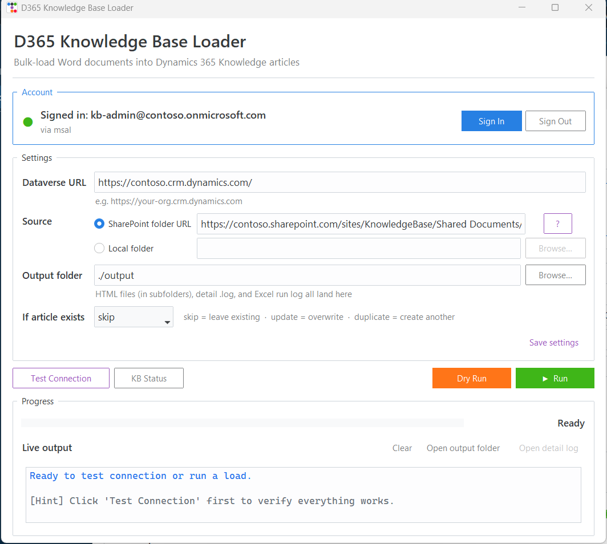
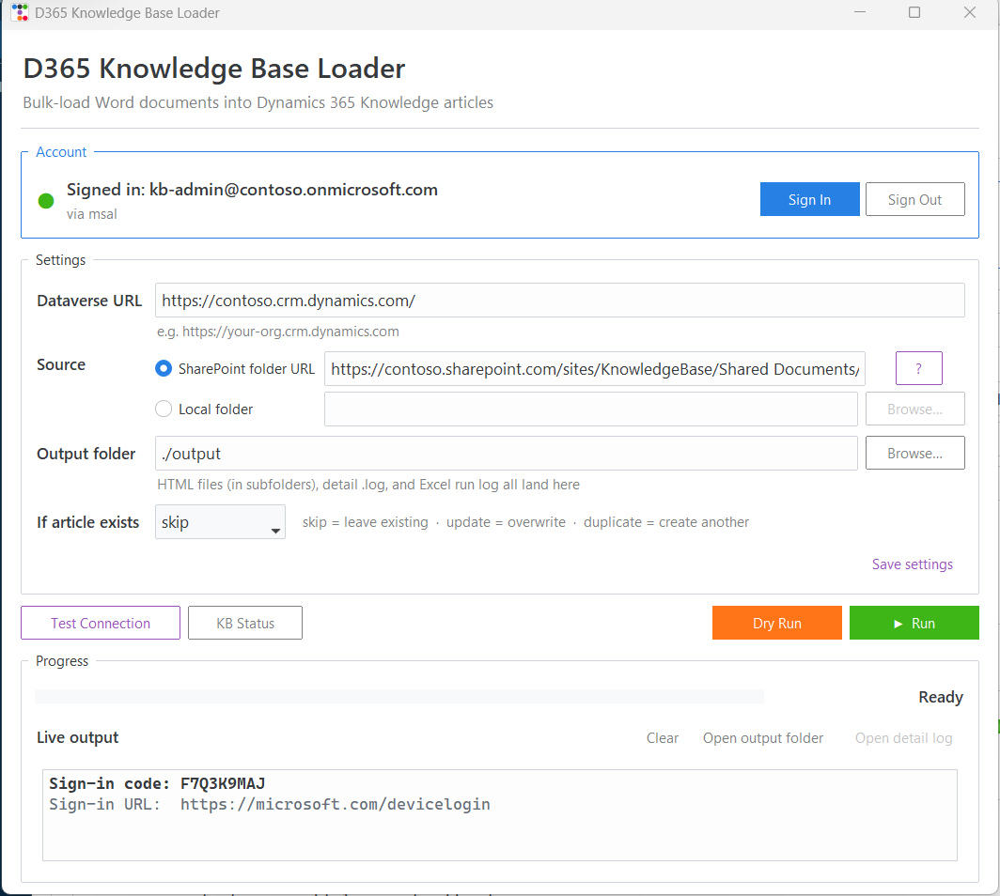

# D365 Knowledge Base Loader

A simple cross-platform tool that bulk-loads Word documents (`.docx` and `.doc`) into Dynamics 365 Knowledge Base articles. Works on **Windows** and **macOS**.



---

## Quick Start

### 1. Install Python (one-time)

Download Python **3.10 or newer** from [python.org/downloads](https://www.python.org/downloads/).

> **Windows:** During install, check the box that says **"Add python.exe to PATH"**.
> **macOS:** Or use Homebrew: `brew install python`.

### 2. Run the app

Double-click the launcher for your operating system:

| OS | Launcher | Notes |
|----|----------|-------|
| **Windows** | `run.bat` | Double-click in File Explorer |
| **macOS** | `run.command` | If macOS blocks it the first time, **right-click → Open** |

The first run takes about a minute to set up the Python environment and install dependencies. After that the app opens in a few seconds.

### 3. Use the app

1. Click **Sign In** (a browser window opens — sign in with your Microsoft account)
2. Fill in the **Dataverse URL** (e.g. `https://your-org.crm.dynamics.com`)
3. Pick your **source** (SharePoint URL or local folder)
4. Click **Test Connection** to verify everything works
5. Click **Dry Run** first to preview the conversion
6. Click **▶ Run** to publish to D365

That's it. Your settings are remembered for next time.

---

## What each section does

### 1. Account


The colored dot tells you at a glance whether you're signed in:

| Dot | Meaning |
|-----|---------|
| 🟢 Green | Signed in — ready to use |
| ⚪ Grey  | Not signed in yet |
| 🔴 Red   | Authentication isn't available (Azure CLI not installed and no MSAL configured) |

The label below shows **how** you're authenticated:
- **`via az_cli`** — using your existing Azure CLI session (`az login`)
- **`via msal`** — using a registered Entra ID app (set via `AZURE_CLIENT_ID`)

The app **never prompts for a tenant ID**. It auto-detects from your Azure CLI session, or uses MSAL's universal `organizations` authority so any work/school account works.

### 2. Settings

| Field | Purpose |
|-------|---------|
| **Dataverse URL** | The URL of your D365 environment (e.g. `https://your-org.crm.dynamics.com`) |
| **Source: SharePoint folder URL** | Read documents from SharePoint via the Microsoft Graph API. Paste **either** a URL from your browser address bar **or** a sharing link (`Copy link` from SharePoint) — both work. Click the **?** button next to the field for visual help. |
| **Source: Local folder** | Read documents from a folder on your computer (e.g. a OneDrive-synced SharePoint folder) |
| **Output folder** | Where HTML files and Excel run logs are written. Defaults to `./output` |
| **If article exists** | What to do when a Knowledge Article with the same title already exists: |
| | • **skip** — leave the existing one alone (safest, default) |
| | • **update** — overwrite the existing article's content |
| | • **duplicate** — create a new article anyway |

Click **Save settings** at the bottom-right to persist your form values to `~/.d365kbloader/settings.json` so they're remembered across runs and reinstalls.

> **Tip:** The Run button automatically saves your settings before starting, so you rarely need to click Save manually.

### 3. Action buttons

| Button | What it does |
|--------|-------------|
| **Test Connection** | Verifies your Dataverse URL works and the source (SharePoint / local folder) is reachable. Reports the number of files found and total KB articles |
| **KB Status** | Shows how many Knowledge Articles exist by status (Draft, Published, Archived, etc.) |
| **Dry Run** | Converts files to HTML and writes the run log, but **does NOT publish** to D365. Useful for previewing |
| **▶ Run** | The real thing — converts, publishes to D365, and updates Knowledge Articles |

> **Recommendation:** Always do a **Dry Run** first to verify file conversion, then **Run** when you're happy with the preview.

### 4. Progress

While a run is in progress:

- **Progress bar** fills as files are processed
- **X / Y counter** on the right shows current file number
- **Live output** displays each file's outcome on a separate line:
  - `content: yes/EMPTY` — whether the document had content
  - `html: saved/skipped` — whether an HTML file was written (skipped for empty docs)
  - `kb: created/updated/skipped (exists)/dry run/ERROR` — what happened in D365

Above the log:
- **Clear** — wipe the live output
- **Open output folder** — open the folder with HTML files & logs in Explorer/Finder
- **Open detail log** — open the timestamped `.log` file with full debug detail (enabled after a run)

---

## What gets created in D365

Each Word document becomes a Knowledge Article with these fields:

| Field | Value |
|-------|-------|
| **Title** | Filename without extension (e.g. `Refund Policy.docx` → `Refund Policy`) |
| **Content** | Full HTML converted from the Word document |
| **Language** | English (locale 1033) |
| **Creation mode** | Manual |
| **Description** | `Auto-imported from SharePoint: <source path>` |
| **Keywords** | The source file path (for traceability) |
| **Status** | Published (transitioned through Draft → Approved → Published) |

Empty documents (no content after conversion) are **skipped** — no HTML file is written and no KB article is created.

---

## Authentication

The app supports two authentication methods, chosen automatically:

| Method | When it's used | Setup |
|--------|----------------|-------|
| **Azure CLI** *(default)* | When `az` is installed on your machine | Run `az login` once in a terminal — or just click Sign In in the app |
| **MSAL** *(fallback)* | When `AZURE_CLIENT_ID` is set in `.env` | An IT admin registers a public client app once in Entra ID. No Azure subscription required. |

When you click **Sign In** in the GUI, a dialog appears showing a **device-code** like `F7Q3K9MAJ`:



The browser opens automatically to https://microsoft.com/devicelogin — paste the code there and sign in with your Microsoft account. The dialog closes automatically once sign-in completes.

> **Why a code instead of a popup?** Browser-based sign-in windows often get hidden behind other apps. The device-code flow is more reliable because the code is always visible right in the app.

Both methods cache tokens for future runs (24 hours typically).

### Required permissions

Your Microsoft account needs:
- **D365**: any role that lets you create/edit Knowledge Articles (e.g. Knowledge Manager)
- **SharePoint** *(if using SharePoint source)*: read access to the site
- **Azure subscription**: not required for MSAL; required for Azure CLI

---

## What goes in the output folder

Everything writes to the **single output folder** you choose (default: `./output`):

```
output/
├── 📁 KB Main Folder/                                ← matches your source structure
│   ├── 📁 Dynamic Rebooking Tool/
│   │   ├── 📄 Customer Accepts Auto Reaccommodated Flight….html
│   │   └── 📄 Customer Rebooks to Finnair….html
│   └── 📄 Refund Policy.html
├── 📄 kb_loader_20260501_080100.log                  ← detail log (per run)
└── 📄 kb_loader_log_20260501_080100.xlsx             ← Excel run log (per run)
```

- **HTML files** — one per Word document, in subfolders matching the source folder structure. Empty documents are skipped (no HTML written).
- **`kb_loader_YYYYMMDD_HHMMSS.log`** — full timestamped log with every step (great for troubleshooting)
- **`kb_loader_log_YYYYMMDD_HHMMSS.xlsx`** — Excel summary with one row per file:

| Column | Description |
|--------|-------------|
| File Name | Original filename |
| Folder Path | Subfolder relative to source root |
| File Size | Bytes |
| Has Content | Yes / No |
| HTML Saved | Yes / No |
| Published to KB | Yes / No / Skipped |
| KB Action | Created / Updated / Skipped / Dry Run / Error |
| Article ID | Dataverse `knowledgearticleid` |
| Error | Error message if processing failed |

Cells are color-coded (green = yes, red = no, yellow = skipped). The Excel file also includes a **before/after KB article count comparison** at the top.

> Click **Open output folder** in the GUI to jump straight to it. The live output area also tells you how many HTML files / logs are currently there.

---

## Troubleshooting

| Symptom | Try this |
|---------|----------|
| **"Python is not installed"** when launching | Install Python from [python.org](https://www.python.org/downloads/). On Windows, check "Add to PATH" during install |
| **macOS: "cannot be opened because the developer cannot be verified"** | Right-click `run.command` → **Open** → click **Open** in the dialog |
| **Sign-in keeps re-prompting** | Click **Sign Out** in the app, then **Sign In** again. If using Azure CLI, run `az logout && az login` in a terminal |
| **"Could not get a token from Azure CLI"** | Your account may not have access to that D365 environment. Contact your D365 admin |
| **"This looks like a SharePoint sharing link"** | This warning is gone in the latest version — sharing links are now resolved automatically. If you still see it, click the **?** button next to the SharePoint field for help |
| **Legacy `.doc` files don't convert** | Install [LibreOffice](https://www.libreoffice.org/download/). Modern `.docx` files don't need it |
| **GUI looks tiny on a HiDPI monitor** | The app enables Windows DPI awareness automatically. If still tiny, try moving the window to your primary display |

For deeper investigation, click **Open detail log** in the GUI (or open the timestamped `.log` file in your output folder) to see the full trace.

---

## Command-line usage (advanced)

The CLI is still available for scripted/automated runs:

```bash
# Launch the GUI (default with no args)
python -m kb_loader

# CLI mode
python -m kb_loader --local-folder "C:\docs" --dry-run
python -m kb_loader --sharepoint-url "https://..." --existing update
python -m kb_loader --kb-status
python -m kb_loader --help
```

CLI args override `.env` and `~/.d365kbloader/settings.json`.

---

## Cross-platform support

The app is built with cross-platform tooling and tested on Windows. The same code paths run on macOS:

- ✅ **Windows 10/11** — primary development platform
- ✅ **macOS 12+** — uses native Aqua look-and-feel via Tk
- ✅ **Linux** — should work but not actively tested

Platform-specific behavior:
- **Fonts** — Segoe UI on Windows, SF Pro on macOS, DejaVu on Linux
- **HiDPI** — Windows DPI awareness is enabled automatically; macOS Retina is native
- **File opening** — `os.startfile` on Windows, `open` on macOS, `xdg-open` on Linux
- **Azure CLI calls** — uses `shell=True` only on Windows for `az.cmd` resolution

---

## Project structure

```
D365KBLoader/
├── run.bat                    ← Windows launcher (double-click)
├── run.command                ← macOS launcher (double-click)
├── requirements.txt           ← Python dependencies
├── README.md                  ← this file
├── docs/
│   ├── screenshot.png         ← UI screenshot for the README
│   └── capture_screenshot.py  ← Utility to regenerate the screenshot
└── kb_loader/
    ├── __main__.py            ← CLI / GUI entry point
    ├── gui.py                 ← Tkinter + ttkbootstrap GUI
    ├── service.py             ← Core load logic (used by both CLI and GUI)
    ├── settings.py            ← User-profile settings store (~/.d365kbloader/settings.json)
    ├── auth.py                ← MSAL + Azure CLI authentication
    ├── sharepoint_client.py   ← SharePoint via Graph API
    ├── dataverse_client.py    ← D365 Knowledge Article CRUD
    ├── converter.py           ← Word → HTML conversion
    └── run_log.py             ← Excel run log generator
```
